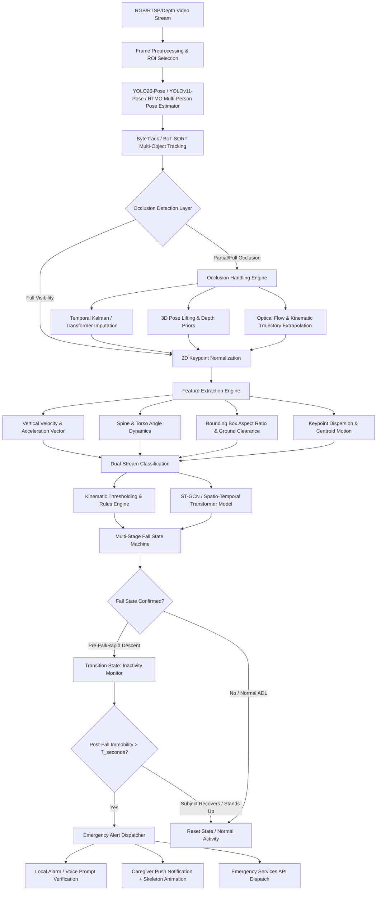
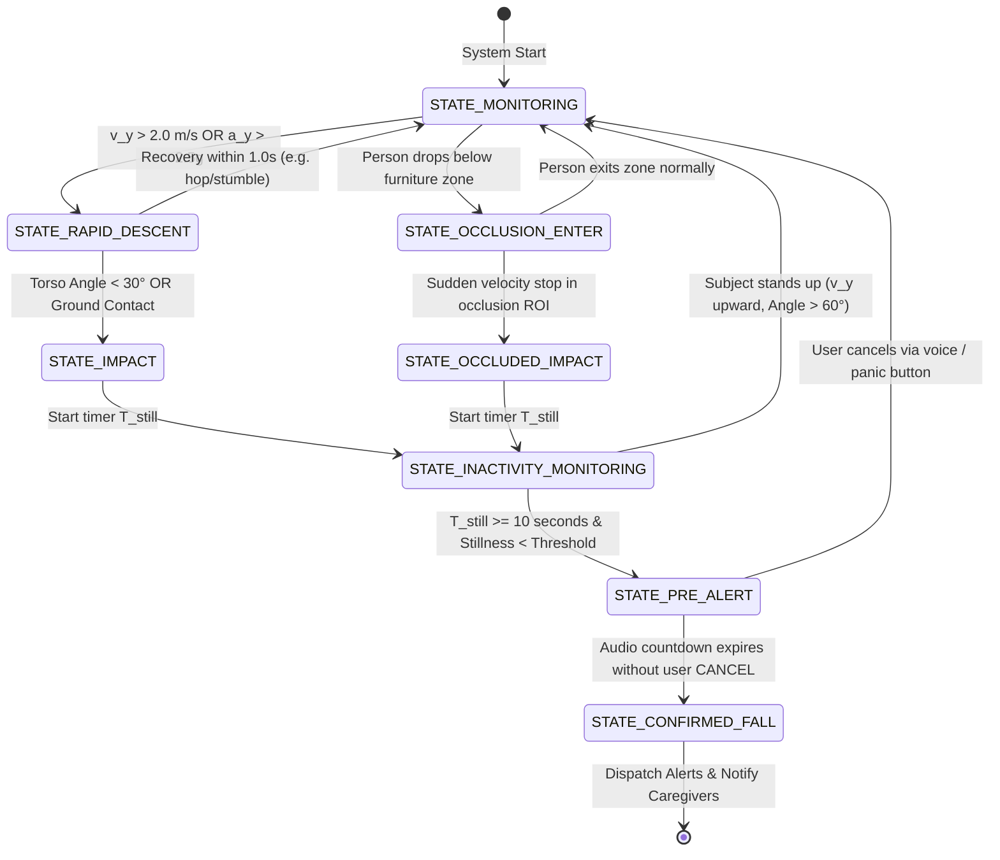
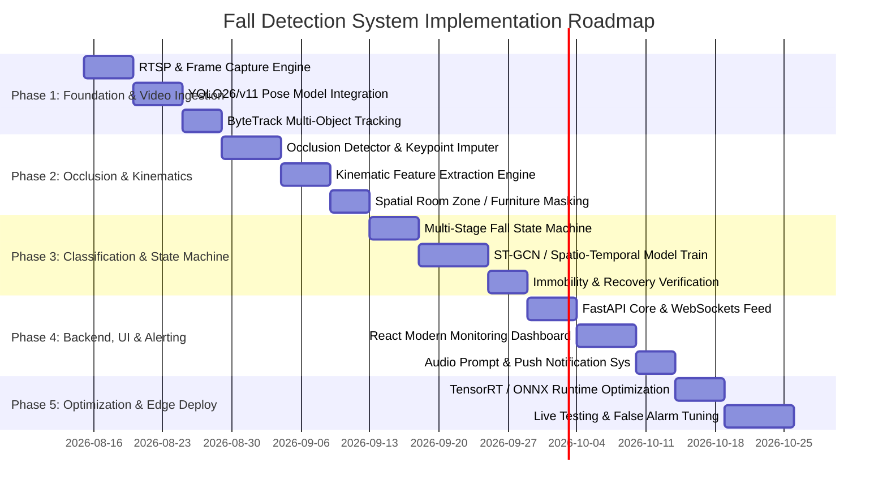

```mermaid
graph TD
    subgraph S1[Tier 1: Pose Imputation & Graph Recovery]
        A1[Missing Keypoints Detection] --> A2[Spatio-Temporal GCN Masked Autoencoding]
        A2 --> A3[Topological Bone Length Constraint Projection]
    end
    
    subgraph S2[Tier 2: Temporal Trajectory & Kinematic Tracking]
        B1[Tracklet Loss Prediction] --> B2[Extended Kalman Filter / Optical Flow Vector]
        B2 --> B3[Sudden Velocity Vector Downward into Occlusion Zone]
    end
    
    subgraph S3[Tier 3: Spatial Scene Priors & Occlusion Zone Mapping]
        C1[Semantic Room Segmentation] --> C2[Furniture & Occlusion Region Masking]
        C2 --> C3[Occlusion Zone Inactivity & Disappearance Timer]
    end
    
    subgraph S4[Tier 4: Cross-View / Multi-Camera Homography]
        D1[Camera 1 View: Occluded] --> D2[Multi-View Epipolar Geometry Fusion]
        D3[Camera 2 View: Clear Angle] --> D2
    end
```

# 实时单人及老人跌倒检测系统
## 系统架构、遮挡处理与技术规格

---

## 1. 执行摘要

本文档描述一个人工智能驱动的**单人及老人跌倒检测系统**的完整技术规格。视觉跌倒检测在真实场景（尤其是家庭和养老环境）中面临的首要问题是**遮挡**：例如床、桌子、沙发、椅子或门框造成的部分遮挡，以及人体自遮挡。

本设计重点关注以下目标：

1. **高灵敏度与高特异性**：真实跌倒检出率高于 98%，同时保持极低误报率。
2. **遮挡鲁棒性**：采用多层时空关键点插补、质心轨迹运动学、3D 姿态提升与遮挡区域状态跟踪。
3. **边缘优先与隐私保护**：在边缘设备（NVIDIA Jetson、Intel NUC、Hailo-8）本地处理视频流，不向云端发送原始 RGB 视频。关键点与匿名火柴人表示在边缘即时提取。
4. **多阶段验证状态机**：避免将日常活动（如快速躺上床、快速坐下、系鞋带）误判为跌倒。

---

## 2. 端到端系统架构

端到端处理管线以 15-30 FPS 处理来自标准 IP/RTSP 摄像头、广角吸顶/壁挂镜头或多相机组合的实时视频帧。



---

## 3. 遮挡问题：深入分析与技术方案

遮挡是视觉跌倒检测失败的最主要原因。当老人倒在沙发、咖啡桌或床后时，传统姿态估计算法会丢失地标跟踪（脚踝、膝盖或髋部缺失），从而导致严重的误分类或漏检。

```
       [Camera View]
             │
             ▼
      ┌─────────────┐
      │   (Head)    │  <-- Visible
      │   (Torso)   │  <-- Visible
   █████████████████████  <-- [OCCLUSION BARRIER: Table/Bed/Sofa]
   ░░░░░░░░░░░░░░░░░░░░░
   ░ (Knees/Ankles Lost)░  <-- Occluded Keypoints (Confidence Score < 0.2)
```

### 3.1 遮挡下的失效模式

1. **关键点消失**：下肢关节点丢失后，依赖地面接触和姿态角度的常规指标无法计算。
2. **边界框纵横比突变**：人倒在家具后时，其边界框高度瞬时下降，标准检测器可能将其误判为正常坐下或走远。
3. **轨迹碎片化（ID 切换）**：遮挡期间可能丢失跟踪 ID，破坏跨帧的垂直速度计算。
4. **运动停滞导致的漏检**：如果人完全躺在遮挡物后方，无法通过视觉确认跌倒后的静止姿态。

---

### 3.2 多层遮挡缓解策略



#### 策略 A：图神经网络关键点插补与骨骼约束

当关键点置信度 `c_i < τ_conf`（例如小于 0.25）时，将其标记为遮挡。与其丢弃该帧或将坐标置零，不如：

- **空间生物力学先验**：利用人体运动学树先验（刚性骨骼长度 `ℓ_ij = ‖p_i - p_j‖₂`），根据可见父节点（如髋 → 膝 → 踝）约束遮挡关节的可能位置。
- **时间 GCN 插补**：使用双向 ST-GCN / 时空 Transformer（或 Bi-LSTM），在滑动窗口 `W = [t-N, ..., t]` 上学习关节轨迹，基于运动动量插补缺失坐标。

#### 策略 B：质心运动学与光流矢量集成

即使约 70% 的身体被家具遮挡，可见的上半身（头、颈、肩）和全局质心仍会表现出明显的跌倒动态：

- **垂直速度突增（`v_y`）**：
  $$\bar{v}_y(t) = \frac{1}{|V_{vis}|} \sum_{i \in V_{vis}} \frac{y_i(t) - y_i(t - \Delta t)}{\Delta t}$$
- **垂直加速度尖峰（`a_y`）**：
  $$a_y(t) = \frac{\bar{v}_y(t) - \bar{v}_y(t - \Delta t)}{\Delta t} > a_{fall\_threshold} \quad (\approx 2.5 - 3.5 \text{ g})$$
- **稠密光流方向**：在人体边界框上评估稀疏 Lucas-Kanade 或 RAFT 光流矢量，检测突然的向下通量，随后在落地/家具高度处运动突然停止。

#### 策略 C：语义遮挡区域映射与"坠入遮挡"状态跟踪

1. **场景静态标定 / 语义分割**：初始部署时，使用语义分割（如 SegFormer / SAM）生成二维平面图掩码，标识潜在的遮挡区域（沙发、桌子、床、柜子）。
2. **进入动态分析**：
   - 人以正常速度走过沙发后方（`v_y ≈ 0, v_x ≈ 常数`）时，状态为 `NORMAL_OCCLUSION`。
   - 人携带较大的垂直向下加速度矢量（`a_y >> 0`）进入遮挡区域并下降到家具边缘以下时，状态为 `FALL_INTO_OCCLUSION_SUSPECTED`。
3. **静止 / 消失计时器**：若状态为 `FALL_INTO_OCCLUSION_SUSPECTED`，且人在可配置窗口（如 10-20 秒）内没有重新出现或恢复站立姿态，则触发跌倒报警。

#### 策略 D：多相机极线几何一致性（可选多视角部署）

在多相机安装场景（如客厅对角线布设两个相机）中：

- 计算视图间的单应矩阵 `H₁₂` 与基础矩阵 `F`。
- 若相机 1 存在严重遮挡，相机 2 无遮挡的 3D 射线投影可通过直接线性变换（DLT）或极线匹配重建完整 3D 骨架。

---

## 4. 详细技术管线与模块

```
┌────────────────────────────────────────────────────────────────────────────┐
│                             VIDEO INPUT LAYER                              │
│              RTSP Stream / USB UVC / Depth Camera (15 - 30 FPS)            │
└─────────────────────────────────────┬──────────────────────────────────────┘
                                      │
                                      ▼
┌────────────────────────────────────────────────────────────────────────────┐
│                   MODULE 1: DETECTION & MULTI-OBJECT TRACKING              │
│  - Object Detection: YOLO26-Pose / YOLOv11-Pose / RTMO                     │
│  - Multi-Object Tracker: ByteTrack with Re-ID (Maintains Tracklet IDs)     │
│  - Keypoint Extractor: 17/26 Anatomical Landmarks (COCO/Halpe format)      │
└─────────────────────────────────────┬──────────────────────────────────────┘
                                      │
                                      ▼
┌────────────────────────────────────────────────────────────────────────────┐
│                   MODULE 2: OCCLUSION & KINEMATIC ENGINE                   │
│  - Confidence Evaluator per Landmark: (c_i < 0.25 -> Occluded)             │
│  - Spatial-Temporal Joint Imputation (Biomechanical & GCN priors)          │
│  - Kinematic Feature Extraction:                                           │
│      * Head/Torso Vertical Velocity (v_y) and Acceleration (a_y)           │
│      * Torso Angle relative to Floor Plane (theta_torso)                   │
│      * Centroid Trajectory & Motion Vector Direction                       │
│      * Bounding Box Aspect Ratio (W/H) & Rate of Expansion/Shrinkage       │
└─────────────────────────────────────┬──────────────────────────────────────┘
                                      │
                                      ▼
┌────────────────────────────────────────────────────────────────────────────┐
│                   MODULE 3: DUAL-ENGINE FALL CLASSIFIER                    │
│                                                                            │
│   ┌──────────────────────────────┐    ┌────────────────────────────────┐   │
│   │   Stream A: Physics & Rule   │    │  Stream B: Deep Spatio-        │   │
│   │   Engine                     │    │  Temporal Graph Model          │   │
│   │   - Velocity/Acceleration    │    │  - ST-GCN / CTR-GCN            │   │
│   │     Thresholds               │    │  - 30-60 frame temporal window │   │
│   │   - Torso Incline Angle >60° │    │  - Fall vs ADL probability     │   │
│   │   - Aspect Ratio W/H > 1.2   │    │    softmax score               │   │
│   └──────────────┬───────────────┘    └────────────────┬───────────────┘   │
│                  └───────────────┬─────────────────────┘                   │
│                                  ▼                                         │
│                    Fused Fall Probability P(Fall)                          │
└─────────────────────────────────────┬──────────────────────────────────────┘
                                      │
                                      ▼
┌────────────────────────────────────────────────────────────────────────────┐
│                   MODULE 4: MULTI-STAGE FALL STATE MACHINE                 │
│                                                                            │
│   [Normal (Standing/Walking)] ──(High Descent Rate)──> [Pre-Fall Descent] │
│                                                                 │          │
│   [Recovery / Stand Up] <──(Vertical Rise)── [Impact / Ground Contact]     │
│                                                     │                      │
│                                              (No Movement)                 │
│                                                     ▼                      │
│                                              [Immobility Timer]            │
│                                                     │                      │
│                                            (Timer > T_threshold)           │
│                                                     ▼                      │
│                                              [CONFIRMED FALL]              │
└─────────────────────────────────────┬──────────────────────────────────────┘
                                      │
                                      ▼
┌────────────────────────────────────────────────────────────────────────────┐
│                   MODULE 5: ALERTING & VERIFICATION DISPATCHER             │
│  - Local Voice Warning ("Fall detected. Press button or say CANCEL")       │
│  - WebRTC / MQTT Push to Caregiver Mobile App with Privacy Pose GIF        │
│  - Telephony / SMS / Emergency Escalation (Twilio / Webhook API)           │
└────────────────────────────────────────────────────────────────────────────┘
```

---

## 5. 数学公式与特征工程

### 5.1 关键地标索引（COCO 17 点格式参考）

- **鼻子**: 0 | **眼睛**: 1, 2 | **耳朵**: 3, 4
- **肩膀**: 5（左）, 6（右）
- **手肘**: 7, 8 | **手腕**: 9, 10
- **髋部**: 11（左）, 12（右）
- **膝盖**: 13（左）, 14（右）
- **脚踝**: 15（左）, 16（右）

---

### 5.2 核心特征公式

#### 1. 肩部中点与髋部中点
$$P_{shoulder}(t) = \frac{P_5(t) + P_6(t)}{2}, \quad P_{hip}(t) = \frac{P_{11}(t) + P_{12}(t)}{2}$$

#### 2. 躯干相对地面的角度（`θ_torso`）
连接髋部中点与肩部中点的矢量：
$$\vec{V}_{torso}(t) = P_{shoulder}(t) - P_{hip}(t) = \begin{bmatrix} x_s - x_h \\ y_s - y_h \end{bmatrix}$$
`θ_torso` 相对水平地面的角度：
$$\theta_{torso}(t) = \left| \arctan2\left(y_s - y_h, x_s - x_h\right) \right| \times \frac{180^\circ}{\pi}$$
- *站立 / 行走*：`θ_torso ≈ 70° - 90°`
- *跌倒 / 平躺*：`θ_torso ≈ 0° - 30°`

#### 3. 归一化垂直质心速度（`V_y^norm`）
设 `H_bbox(t)` 为人的边界框高度：
$$V_y^{norm}(t) = \frac{y_{hip}(t) - y_{hip}(t - \Delta t)}{\Delta t \cdot H_{bbox}(t)}$$
跌倒事件会产生明显的峰值：`V_y^norm > τ_velocity_fall`。

#### 4. 边界框纵横比变化率（`ΔAR`）
$$AR(t) = \frac{\text{Width}(t)}{\text{Height}(t)}$$
$$\Delta AR(t) = \frac{AR(t) - AR(t - \Delta t)}{\Delta t}$$
- *站立*：`AR ≈ 0.3 - 0.5`
- *跌倒*：`AR ≥ 1.2 - 2.5`

#### 5. 落地后静止指标（`M_inactivity`）

在滑动窗口 `W = [t_impact, t_impact + T]` 上计算：
$$\mathcal{M}_{inactivity} = \frac{1}{|W|} \sum_{k \in W} \sum_{i \in V_{vis}} \| P_i(k) - P_i(k - 1) \|_2$$
当 `M_inactivity < ε_stillness` 且持续 `T ≥ 10 秒` 时，确认静止。

---

## 6. 区分跌倒与日常活动（ADL）

朴素跌倒检测系统的一个常见问题是日常活动导致的高误报率。下表说明多阶段架构如何区分真实跌倒与常见日常活动：

| 活动 | 垂直速度 (`v_y`) | 躯干角度 (`θ_torso`) | 冲击加速度 (`a_y`) | 事件后静止 | 遮挡特征 | 系统判定 |
| :--- | :--- | :--- | :--- | :--- | :--- | :--- |
| **意外跌倒** | **高峰值（> 3.0g）** | **< 30°（水平）** | **剧烈** | **持续（>10s）** | 常进入下部遮挡区 | **FALL CONFIRMED** |
| **坐到椅子上** | 中等 / 受控 | `60° - 85°`（直立） | 低 / 无 | 正常小幅移动 | 躯干保持可见 | **Normal（忽略）** |
| **躺到床上** | 缓慢 / 渐进 | `< 30°`（水平） | 很低 | 静止 | 位于床 ROI 区域 | **Normal（床 ROI）** |
| **弯腰拾物** | 中等 | `20° - 45°` | 无 | 很短暂（< 3s） | 完全恢复站立 | **Normal（快速恢复）** |
| **系鞋带** | 缓慢下蹲 | `30° - 50°` | 无 | 持续手部动作 | 上半身可见移动 | **Normal（微动作）** |
| **绊倒后迅速恢复** | 高峰值 | 动态 | 中等 | 无静止 | 立即起身 | **Near-Miss 记录** |
| **倒在沙发/床后** | **高初始峰值** | **丢失 / 插补为平躺** | **高** | **在遮挡 ROI 内消失** | 突然消失且未出现 | **OCCLUDED FALL** |

---

## 7. 软件架构与推荐技术栈

```
                                SYSTEM SOFTWARE STACK
 ┌─────────────────────────────────────────────────────────────────────────────┐
 │                         APPLICATION & USER INTERFACE                        │
 │  - Real-Time Web Dashboard (React + TypeScript + Vite + TailwindCSS)        │
 │  - Mobile Notification Receiver (React Native / Flutter / Push Notifications)│
 │  - WebRTC Low-Latency Video/Skeleton Streamer                               │
 ├─────────────────────────────────────────────────────────────────────────────┤
 │                          SERVICES & COMMUNICATION                           │
 │  - API Backend: FastAPI (Python 3.10+) / Async WebSockets                   │
 │  - Message Broker: Redis Pub/Sub or Eclipse Mosquitto (MQTT)                │
 │  - Incident Database: SQLite / PostgreSQL (Alert logs, metadata only)       │
 ├─────────────────────────────────────────────────────────────────────────────┤
 │                         INFERENCE & VISION PIPELINE                         │
 │  - Deep Learning Framework: PyTorch 2.x, ONNX Runtime, TensorRT 10.x        │
 │  - Pose Estimation Models: YOLO26n-Pose / YOLOv11s-Pose / RTMO              │
 │  - Tracking: ByteTrack (C++ / Cython binding)                               │
 │  - GCN Sequence Classifier: Spatial-Temporal GCN (ST-GCN / CTR-GCN)         │
 │  - Vision Utilities: OpenCV 4.x, NumPy, SciPy                               │
 ├─────────────────────────────────────────────────────────────────────────────┤
 │                           HARDWARE & RUNTIME LAYER                          │
 │  - OS: Ubuntu 22.04 LTS / Debian Embedded / Windows 11 (CUDA Enabled)       │
 │  - Compute Targets: NVIDIA Jetson Orin Nano/NX, RTX 3060/4060, or Intel NUC │
 └─────────────────────────────────────────────────────────────────────────────┘
```

---

## 8. 实现目录与文件结构

实施阶段，代码库将按模块化组件组织：

```
fall-detection-system/
├── configs/
│   ├── app_config.yaml               # Pipeline parameters, camera URLs, thresholds
│   ├── model_config.yaml             # YOLO pose weights, ST-GCN checkpoints
│   └── zones_config.json             # Room semantic zones (Beds, Sofas, Blind spots)
│
├── core/
│   ├── __init__.py
│   ├── capture/
│   │   ├── stream_manager.py         # Multi-threaded RTSP / WebCam reader
│   │   └── frame_buffer.py           # Thread-safe ring buffer for low latency
│   │
│   ├── detection/
│   │   ├── pose_detector.py          # YOLO26/v11 Pose wrapper with ONNX/TensorRT
│   │   ├── tracker.py                # ByteTrack integration for multi-person tracking
│   │   └── landmark_utils.py         # COCO/Halpe keypoint topology & normalization
│   │
│   ├── occlusion/
│   │   ├── occlusion_analyzer.py     # Missing keypoint detector & confidence scoring
│   │   ├── gcn_imputer.py            # Spatio-temporal pose reconstruction model
│   │   ├── kinematic_extrapolator.py # Extended Kalman Filter for occluded trajectories
│   │   └── zone_manager.py           # Occlusion ROI & furniture boundary manager
│   │
│   ├── analytics/
│   │   ├── feature_extractor.py      # Computes velocity, acceleration, torso angle
│   │   ├── st_gcn_classifier.py      # Deep spatio-temporal sequence model
│   │   ├── state_machine.py          # Multi-stage Fall State Machine (Pre-Fall, Impact, Inactive)
│   │   └── immobility_tracker.py     # Post-fall stillness & micro-motion monitor
│   │
│   └── alerting/
│       ├── alert_dispatcher.py       # Manages priority escalation (Local -> App -> SMS)
│       ├── audio_prompt.py           # Audio cancellation countdown ("Press to cancel")
│       └── privacy_filter.py         # Generates anonymized stick-figure animations/GIFs
│
├── server/
│   ├── app.py                        # FastAPI application entry point
│   ├── routes/
│   │   ├── api.py                    # REST endpoints for config, logs, camera status
│   │   └── websocket.py              # WebSocket feed for real-time telemetry & skeleton data
│   └── webrtc/
│       └── stream_server.py          # WebRTC video/metadata streaming
│
├── web/                              # Premium React Dashboard (Monitoring UI)
│   ├── src/
│   │   ├── components/
│   │   │   ├── LiveVideoPlayer.tsx   # Live stream with skeleton overlay & ROI bounds
│   │   │   ├── TelemetryPanel.tsx    # Real-time velocity, angle, state gauges
│   │   │   ├── IncidentLog.tsx       # Incident history, replay, and false alarm tagging
│   │   │   └── ZoneConfigModal.tsx   # Interactive room furniture/occlusion zone drawing tool
│   │   └── App.tsx
│   ├── package.json
│   └── vite.config.ts
│
├── models/                           # Pretrained & exported ONNX/TensorRT model weights
│   ├── yolo26n-pose.onnx
│   └── st_gcn_fall_resnet.onnx
│
├── tests/
│   ├── test_occlusion_imputation.py  # Unit tests for synthetic joint occlusion
│   ├── test_kinematics.py            # Unit tests for velocity/angle formulations
│   └── test_state_machine.py         # Unit tests for state transitions and timeouts
│
├── requirements.txt                  # Python dependencies
├── Dockerfile                        # Containerized deployment with CUDA runtime
└── README.md                         # Setup guide and quickstart
```

---

## 9. 状态机逻辑与算法伪代码

### 9.1 多阶段状态机转移



---

### 9.2 跌倒检测与遮挡处理引擎伪代码

```python
"""
Core Fall Detection & Occlusion Handling Logic
"""

import numpy as np
from enum import Enum
from dataclasses import dataclass
from typing import List, Optional, Tuple

class FallState(Enum):
    MONITORING = 0
    RAPID_DESCENT = 1
    IMPACT = 2
    INACTIVITY_CHECK = 3
    PRE_ALERT = 4
    CONFIRMED_FALL = 5

@dataclass
class Keypoint:
    x: float
    y: float
    confidence: float
    is_occluded: bool = False

@dataclass
class PersonTracklet:
    track_id: int
    keypoints_history: List[List[Keypoint]]  # Sliding window (last 60 frames)
    current_state: FallState = FallState.MONITORING
    inactivity_counter_sec: float = 0.0
    pre_alert_counter_sec: float = 0.0
    in_occlusion_zone: bool = False

class FallDetectionEngine:
    def __init__(self, fps=30, inactivity_threshold_sec=10.0, pre_alert_sec=15.0):
        self.fps = fps
        self.dt = 1.0 / fps
        self.inactivity_threshold_sec = inactivity_threshold_sec
        self.pre_alert_sec = pre_alert_sec
        
        # Biomechanical & Kinematic Thresholds
        self.CONFIDENCE_THRESHOLD = 0.25
        self.FALL_VELOCITY_THRESH = 2.2      # Normalized vertical descent rate
        self.FALL_ACCEL_THRESH = 2.8         # Downward g-force equivalent
        self.FLAT_TORSO_ANGLE_THRESH = 35.0  # Degrees from horizontal
        self.STILLNESS_ENERGY_THRESH = 12.0  # Max pixel movement for immobility

    def process_frame(self, person: PersonTracklet, occlusion_zones: List[Tuple]) -> FallState:
        """
        Processes a single person tracklet through the multi-stage fall detection pipeline.
        """
        # Step 1: Detect and Impute Occluded Keypoints
        sanitized_kps = self._handle_occlusion(person)
        person.keypoints_history.append(sanitized_kps)
        if len(person.keypoints_history) > 60:
            person.keypoints_history.pop(0)

        if len(person.keypoints_history) < 5:
            return FallState.MONITORING

        # Step 2: Compute Kinematic Metrics
        v_y, a_y = self._calculate_vertical_kinematics(person)
        torso_angle = self._calculate_torso_angle(sanitized_kps)
        aspect_ratio = self._calculate_bbox_aspect_ratio(sanitized_kps)
        is_in_occ_zone = self._check_occlusion_zone_intersection(sanitized_kps, occlusion_zones)
        person.in_occlusion_zone = is_in_occ_zone

        # Step 3: State Machine Evaluation
        state = person.current_state

        if state == FallState.MONITORING:
            # Trigger conditions: rapid descent OR entering occlusion with high velocity
            if (v_y > self.FALL_VELOCITY_THRESH and a_y > self.FALL_ACCEL_THRESH) or \
               (is_in_occ_zone and v_y > self.FALL_VELOCITY_THRESH * 0.8):
                person.current_state = FallState.RAPID_DESCENT

        elif state == FallState.RAPID_DESCENT:
            # Check for impact: Flat body posture or sudden deceleration
            if torso_angle < self.FLAT_TORSO_ANGLE_THRESH or aspect_ratio > 1.2 or is_in_occ_zone:
                person.current_state = FallState.IMPACT
                person.inactivity_counter_sec = 0.0
            elif v_y < 0:  # Ascending / standing back up immediately
                person.current_state = FallState.MONITORING

        elif state == FallState.IMPACT:
            person.current_state = FallState.INACTIVITY_CHECK
            person.inactivity_counter_sec = 0.0

        elif state == FallState.INACTIVITY_CHECK:
            # Immobility measurement over time
            movement_energy = self._compute_recent_motion_energy(person, window_frames=15)
            
            # If person stands up or recovers:
            if torso_angle > 60.0 and v_y < -0.5:
                person.current_state = FallState.MONITORING
                person.inactivity_counter_sec = 0.0
            elif movement_energy < self.STILLNESS_ENERGY_THRESH:
                person.inactivity_counter_sec += self.dt
                if person.inactivity_counter_sec >= self.inactivity_threshold_sec:
                    person.current_state = FallState.PRE_ALERT
                    person.pre_alert_counter_sec = self.pre_alert_sec
            else:
                # Moderate movement detected (e.g. rolling over or struggling)
                person.inactivity_counter_sec = max(0.0, person.inactivity_counter_sec - self.dt * 0.5)

        elif state == FallState.PRE_ALERT:
            # Voice prompt playing: "Fall detected, countdown started"
            person.pre_alert_counter_sec -= self.dt
            if torso_angle > 65.0:  # User stood up during countdown
                person.current_state = FallState.MONITORING
            elif person.pre_alert_counter_sec <= 0.0:
                person.current_state = FallState.CONFIRMED_FALL

        return person.current_state

    def _handle_occlusion(self, person: PersonTracklet) -> List[Keypoint]:
        """
        Applies topological kinematic bone constraints and temporal extrapolation
        for missing or low-confidence joints.
        """
        raw_kps = person.keypoints_history[-1] if person.keypoints_history else []
        if not raw_kps:
            return raw_kps

        imputed_kps = []
        for i, kp in enumerate(raw_kps):
            if kp.confidence < self.CONFIDENCE_THRESHOLD:
                # Joint is occluded; extrapolate from temporal momentum
                extrapolated_pos = self._extrapolate_joint(person, i)
                imputed_kps.append(Keypoint(
                    x=extrapolated_pos[0],
                    y=extrapolated_pos[1],
                    confidence=0.5,
                    is_occluded=True
                ))
            else:
                imputed_kps.append(kp)
        return imputed_kps

    def _calculate_torso_angle(self, kps: List[Keypoint]) -> float:
        """
        Calculates angle between mid-shoulder and mid-hip relative to horizontal.
        """
        left_shoulder, right_shoulder = kps[5], kps[6]
        left_hip, right_hip = kps[11], kps[12]

        mid_shoulder = ((left_shoulder.x + right_shoulder.x) / 2.0, 
                        (left_shoulder.y + right_shoulder.y) / 2.0)
        mid_hip = ((left_hip.x + right_hip.x) / 2.0, 
                   (left_hip.y + right_hip.y) / 2.0)

        dx = mid_shoulder[0] - mid_hip[0]
        dy = mid_shoulder[1] - mid_hip[1]  # Inverted screen Y coordinates

        angle_rad = np.arctan2(abs(dy), abs(dx) + 1e-6)
        return float(np.degrees(angle_rad))

    def _calculate_vertical_kinematics(self, person: PersonTracklet) -> Tuple[float, float]:
        """
        Computes normalized vertical velocity and acceleration of the upper torso.
        """
        if len(person.keypoints_history) < 4:
            return 0.0, 0.0

        y_now = self._get_torso_y(person.keypoints_history[-1])
        y_prev = self._get_torso_y(person.keypoints_history[-2])
        y_prev2 = self._get_torso_y(person.keypoints_history[-3])

        v_y = (y_now - y_prev) / self.dt
        v_y_prev = (y_prev - y_prev2) / self.dt
        a_y = (v_y - v_y_prev) / self.dt

        return float(v_y), float(a_y)

    def _get_torso_y(self, kps: List[Keypoint]) -> float:
        return (kps[5].y + kps[6].y + kps[11].y + kps[12].y) / 4.0

    def _calculate_bbox_aspect_ratio(self, kps: List[Keypoint]) -> float:
        xs = [kp.x for kp in kps if not kp.is_occluded]
        ys = [kp.y for kp in kps if not kp.is_occluded]
        if not xs or not ys:
            return 1.0
        width = max(xs) - min(xs) + 1e-5
        height = max(ys) - min(ys) + 1e-5
        return float(width / height)

    def _compute_recent_motion_energy(self, person: PersonTracklet, window_frames: int = 15) -> float:
        if len(person.keypoints_history) < window_frames:
            return 100.0
        total_movement = 0.0
        for f in range(-window_frames + 1, 0):
            kps_curr = person.keypoints_history[f]
            kps_prev = person.keypoints_history[f - 1]
            for c, p in zip(kps_curr, kps_prev):
                total_movement += np.hypot(c.x - p.x, c.y - p.y)
        return float(total_movement / window_frames)

    def _extrapolate_joint(self, person: PersonTracklet, joint_idx: int) -> Tuple[float, float]:
        if len(person.keypoints_history) < 2:
            return (0.0, 0.0)
        last_valid = person.keypoints_history[-1][joint_idx]
        prev_valid = person.keypoints_history[-2][joint_idx]
        dx = last_valid.x - prev_valid.x
        dy = last_valid.y - prev_valid.y
        return (last_valid.x + dx, last_valid.y + dy)

    def _check_occlusion_zone_intersection(self, kps: List[Keypoint], zones: List[Tuple]) -> bool:
        # Checks if centroid falls within configured furniture polygon bounds
        return False
```

---

## 10. 隐私与合规

对老人的居家监测必须符合严格的隐私标准（如 GDPR 第 9 条、HIPAA）：

1. **零原始视频留存**：
   - 原始视频帧仅存在于易失性内存中供即时推理（帧保留时间 `< 100ms`）。
   - 关键点提取完成后立即销毁视频帧。
2. **匿名火柴人表示**：
   - 看护者和远程仪表盘接收的是矢量骨架动画或边界框，而非可识别的 RGB 图像。
   - 保护卧室和私人起居空间等敏感区域的隐私。
3. **本地边缘计算**：
   - 所有 AI 推理在本地方设备上执行。
   - 仅传输轻量遥测元数据（如 `{"event": "FALL", "timestamp": "2026-08-14T16:36:12Z", "confidence": 0.98}`）。
4. **物理隐私指示灯**：
   - 当摄像头正在处理时，板载硬件 LED 指示灯亮起，确保透明度。

---

## 11. 数据集与模型基准计划

### 11.1 基准数据集

为评估和微调姿态估计器与时空动作分类器，可使用以下数据集：

- **UR Fall Detection Dataset（URFD）**：70 个序列（30 个跌倒 + 40 个日常活动），包含深度与 RGB 数据。
- **Le2i Fall Detection Dataset**：专为真实家庭环境设计的视频序列，涵盖各种光照和家具遮挡。
- **Multiple Camera Fall Dataset（MCFD）**：多视角序列，适合测试跨角度的遮挡恢复。
- **NTU RGB+D 120**：动作识别基准，包含跌倒类别及 100 多种日常活动，可用于负样本训练。
- **UP-Fall Detection Dataset**：结合计算机视觉与可穿戴 IMU 传感器的多模态数据集。

### 11.2 目标性能指标

- **灵敏度（召回率）**：`≥ 98.5%`（漏检真实跌倒会产生严重后果）。
- **特异性**：`≥ 99.0%`（减少看护者的报警疲劳）。
- **误报率（FAR）**：连续监测 24 小时内 `≤ 0.05` 次误报。
- **报警分派延迟**：静止验证结束后 `≤ 1.2 秒`。
- **遮挡鲁棒性**：下肢超过 50% 被遮挡时，检出率 `≥ 92.0%`。

---

## 12. 实施路线图



---

## 13. 总结与后续步骤

本规格定义了一套面向遮挡、保护隐私的现代化跌倒检测架构。开始实施后，可按以下阶段推进：

1. **搭建项目环境**（PyTorch、Ultralytics YOLO26/v11-Pose、ByteTrack、OpenCV）。
2. **开发实时姿态与遮挡插补管线**。
3. **构建多阶段跌倒状态机，并使用模拟或基准跌倒视频片段进行测试**。
4. **开发 FastAPI 流媒体服务器与 React 监控仪表盘**。
