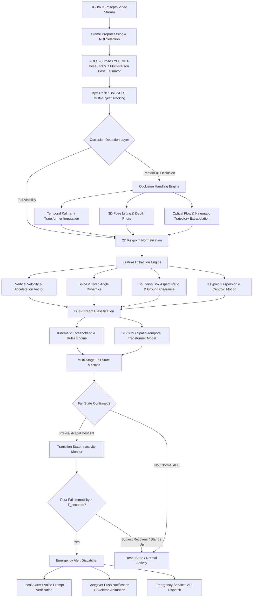
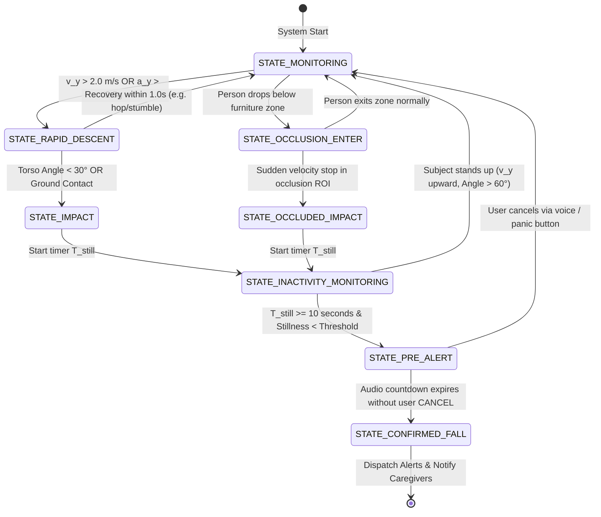
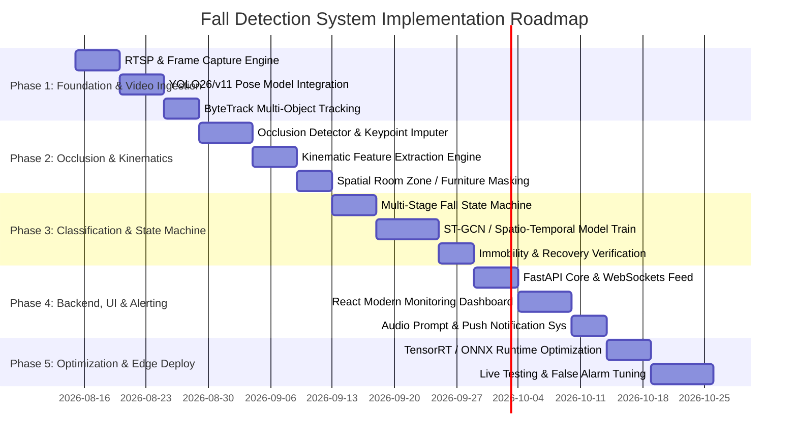

# Real-Time Person & Elderly Fall Detection System
## System Architecture, Occlusion Mitigation & Technical Specification

---

## 1. Executive Summary

This document provides a comprehensive, production-grade architectural specification for an AI-powered **Person & Elderly Fall Detection System**. The primary challenge in real-world vision-based fall detection—particularly in domestic and assisted-living environments—is **occlusion** (e.g., partial blockage by beds, tables, couches, chairs, or doorways, as well as self-occlusion). 

This design emphasizes:
1. **High Sensitivity & Specificity**: >98% true fall detection with near-zero false alarms.
2. **Robust Occlusion Resilience**: Multi-layered spatio-temporal keypoint imputation, centroid trajectory kinematics, 3D pose lifting, and occlusion-zone state tracking.
3. **Edge-First & Privacy-Preserving Architecture**: Processing video streams locally on edge hardware (NVIDIA Jetson, Intel NUC, Hailo-8) without sending raw RGB video streams to the cloud. Keypoints and anonymous stick figures are extracted immediately at the edge.
4. **Multi-Stage Verification State Machine**: Preventing false positives from routine activities of daily living (ADLs) such as quickly lying on a bed, sitting down rapidly, or tying shoelaces.

---

## 2. End-to-End System Architecture

The end-to-end processing pipeline operates on real-time video frames (15–30 FPS) captured from standard IP/RTSP cameras, wide-angle ceiling/wall lenses, or multi-camera setups.



---

## 3. The Occlusion Problem: Deep Dive & Technical Solutions

Occlusion is the single biggest cause of failure in vision-based fall detection. When an elderly person falls behind a sofa, coffee table, or bed, traditional pose estimators lose landmark tracking (missing ankles, knees, or hips), causing catastrophic misclassification or undetected falls.

```
       [Camera View]
             │
             ▼
      ┌─────────────┐
      │   (Head)    │  <-- Visible
      │   (Torso)   │  <-- Visible
   █████████████████████  <-- [OCCLUSION BARRIER: Table/Bed/Sofa]
   ░░░░░░░░░░░░░░░░░░░░░
   ░ (Knees/Ankles Lost)░  <-- Occluded Keypoints (Confidence Score < 0.2)
```

### 3.1 Failure Modes Under Occlusion
1. **Vanishing Keypoints**: Loss of lower-body joints makes standard ground-contact and posture-angle metrics undefined.
2. **Abrupt Aspect-Ratio Shrinkage**: When a person falls behind furniture, their bounding box height instantly drops, which standard detectors might confuse with normal sitting or walking away.
3. **Tracklet Fragmentation (ID Switching)**: Occluded persons may lose track IDs during occlusion, breaking temporal velocity calculations across frames.
4. **False Negatives from Stalled Motion**: The post-fall static posture cannot be visually verified if the person is lying completely behind a barrier.

---

### 3.2 Multi-Tiered Occlusion Mitigation Strategies

```mermaid
graph TD
    subgraph S1[Tier 1: Pose Imputation & Graph Recovery]
        A1[Missing Keypoints Detection] --> A2[Spatio-Temporal GCN Masked Autoencoding]
        A2 --> A3[Topological Bone Length Constraint Projection]
    end
    
    subgraph S2[Tier 2: Temporal Trajectory & Kinematic Tracking]
        B1[Tracklet Loss Prediction] --> B2[Extended Kalman Filter / Optical Flow Vector]
        B2 --> B3[Sudden Velocity Vector Downward into Occlusion Zone]
    end
    
    subgraph S3[Tier 3: Spatial Scene Priors & Occlusion Zone Mapping]
        C1[Semantic Room Segmentation] --> C2[Furniture & Occlusion Region Masking]
        C2 --> C3[Occlusion Zone Inactivity & Disappearance Timer]
    end
    
    subgraph S4[Tier 4: Cross-View / Multi-Camera Homography]
        D1[Camera 1 View: Occluded] --> D2[Multi-View Epipolar Geometry Fusion]
        D3[Camera 2 View: Clear Angle] --> D2
    end
```



#### Strategy A: Graph Neural Network Keypoint Imputation & Bone Constraints
When keypoints have confidence $c_i < \tau_{conf}$ (e.g., $< 0.25$), they are marked as occluded. Rather than discarding the frame or zeroing the coordinates:
- **Spatial Biomechanical Priors**: Use human kinematic tree priors (rigid bone lengths $\ell_{ij} = \|p_i - p_j\|_2$) to bound probable positions of occluded joints relative to visible parent joints (e.g., Hip $\to$ Knee $\to$ Ankle).
- **Temporal GCN Imputation**: Use a bidirectional ST-GCN / Spatio-Temporal Transformer (or Bi-LSTM) that learns joint trajectories over sliding windows $W = [t-N, \dots, t]$ to impute missing coordinates based on movement momentum.

#### Strategy B: Centroid Kinematics & Optical Flow Vector Integration
Even if 70% of the body becomes occluded by furniture, the visible upper body (Head, Neck, Shoulders) and the global centroid exhibit distinctive fall dynamics:
- **Downward Velocity Surge ($v_y$)**:
  $$\bar{v}_y(t) = \frac{1}{|V_{vis}|} \sum_{i \in V_{vis}} \frac{y_i(t) - y_i(t - \Delta t)}{\Delta t}$$
- **Downward Acceleration Spike ($a_y$)**:
  $$a_y(t) = \frac{\bar{v}_y(t) - \bar{v}_y(t - \Delta t)}{\Delta t} > a_{fall\_threshold} \quad (\approx 2.5 - 3.5 \text{ g})$$
- **Dense Optical Flow Direction**: Sparse Lucas-Kanade or RAFT optical flow vectors over the person's bounding box are evaluated for sudden downward flux followed by an abrupt cessation of motion at ground/furniture height.

#### Strategy C: Semantic Occlusion Zone Mapping & "Fall-Into-Occlusion" State Tracking
1. **Scene Static Calibration / Semantic Segmentation**: During initial setup, the system generates a 2D floorplan mask identifying potential occlusion zones (sofas, tables, beds, cabinets) using semantic segmentation (e.g., SegFormer / SAM).
2. **Entry Dynamics Analysis**:
   - If a person walks behind a sofa at normal velocity ($v_y \approx 0, v_x \approx \text{constant}$), state = `NORMAL_OCCLUSION`.
   - If a person enters an occlusion zone with a high downward vertical acceleration vector ($a_y \gg 0$) and drops below the furniture edge, state = `FALL_INTO_OCCLUSION_SUSPECTED`.
3. **Inactivity / Disappearance Timer**: If state is `FALL_INTO_OCCLUSION_SUSPECTED` and the person does not emerge or re-establish a standing posture within a configurable window (e.g., $10 - 20$ seconds), trigger a Fall Alarm.

#### Strategy D: Multi-Camera Epipolar Geometric Consensus (Optional Multi-View Setup)
In multi-camera installations (e.g., living room with 2 diagonal cameras):
- Compute homography matrix $H_{12}$ and fundamental matrix $F$ between views.
- If Camera 1 suffers from severe occlusion, Camera 2's unoccluded 3D ray projection reconstructs the full 3D skeleton using direct linear transformation (DLT) or epipolar line matching.

---

## 4. Detailed Technical Pipeline & Modules

```
┌────────────────────────────────────────────────────────────────────────────┐
│                             VIDEO INPUT LAYER                              │
│              RTSP Stream / USB UVC / Depth Camera (15 - 30 FPS)            │
└─────────────────────────────────────┬──────────────────────────────────────┘
                                      │
                                      ▼
┌────────────────────────────────────────────────────────────────────────────┐
│                   MODULE 1: DETECTION & MULTI-OBJECT TRACKING              │
│  - Object Detection: YOLO26-Pose / YOLOv11-Pose / RTMO                     │
│  - Multi-Object Tracker: ByteTrack with Re-ID (Maintains Tracklet IDs)     │
│  - Keypoint Extractor: 17/26 Anatomical Landmarks (COCO/Halpe format)      │
└─────────────────────────────────────┬──────────────────────────────────────┘
                                      │
                                      ▼
┌────────────────────────────────────────────────────────────────────────────┐
│                   MODULE 2: OCCLUSION & KINEMATIC ENGINE                   │
│  - Confidence Evaluator per Landmark: (c_i < 0.25 -> Occluded)             │
│  - Spatial-Temporal Joint Imputation (Biomechanical & GCN priors)          │
│  - Kinematic Feature Extraction:                                           │
│      * Head/Torso Vertical Velocity (v_y) and Acceleration (a_y)           │
│      * Torso Angle relative to Floor Plane (theta_torso)                   │
│      * Centroid Trajectory & Motion Vector Direction                       │
│      * Bounding Box Aspect Ratio (W/H) & Rate of Expansion/Shrinkage       │
└─────────────────────────────────────┬──────────────────────────────────────┘
                                      │
                                      ▼
┌────────────────────────────────────────────────────────────────────────────┐
│                   MODULE 3: DUAL-ENGINE FALL CLASSIFIER                    │
│                                                                            │
│   ┌──────────────────────────────┐    ┌────────────────────────────────┐   │
│   │   Stream A: Physics & Rule   │    │  Stream B: Deep Spatio-        │   │
│   │   Engine                     │    │  Temporal Graph Model          │   │
│   │   - Velocity/Acceleration    │    │  - ST-GCN / CTR-GCN            │   │
│   │     Thresholds               │    │  - 30-60 frame temporal window │   │
│   │   - Torso Incline Angle >60° │    │  - Fall vs ADL probability     │   │
│   │   - Aspect Ratio W/H > 1.2   │    │    softmax score               │   │
│   └──────────────┬───────────────┘    └────────────────┬───────────────┘   │
│                  └───────────────┬─────────────────────┘                   │
│                                  ▼                                         │
│                    Fused Fall Probability P(Fall)                          │
└─────────────────────────────────────┬──────────────────────────────────────┘
                                      │
                                      ▼
┌────────────────────────────────────────────────────────────────────────────┐
│                   MODULE 4: MULTI-STAGE FALL STATE MACHINE                 │
│                                                                            │
│   [Normal (Standing/Walking)] ──(High Descent Rate)──> [Pre-Fall Descent] │
│                                                                 │          │
│   [Recovery / Stand Up] <──(Vertical Rise)── [Impact / Ground Contact]     │
│                                                     │                      │
│                                              (No Movement)                 │
│                                                     ▼                      │
│                                              [Immobility Timer]            │
│                                                     │                      │
│                                            (Timer > T_threshold)           │
│                                                     ▼                      │
│                                              [CONFIRMED FALL]              │
└─────────────────────────────────────┬──────────────────────────────────────┘
                                      │
                                      ▼
┌────────────────────────────────────────────────────────────────────────────┐
│                   MODULE 5: ALERTING & VERIFICATION DISPATCHER             │
│  - Local Voice Warning ("Fall detected. Press button or say CANCEL")       │
│  - WebRTC / MQTT Push to Caregiver Mobile App with Privacy Pose GIF        │
│  - Telephony / SMS / Emergency Escalation (Twilio / Webhook API)           │
└────────────────────────────────────────────────────────────────────────────┘
```

---

## 5. Mathematical Formulations & Feature Engineering

### 5.1 Key Landmark Indices (COCO 17-Format Reference)
* **Nose**: 0 | **Eyes**: 1, 2 | **Ears**: 3, 4
* **Shoulders**: 5 (Left), 6 (Right)
* **Elbows**: 7, 8 | **Wrists**: 9, 10
* **Hips**: 11 (Left), 12 (Right)
* **Knees**: 13 (Left), 14 (Right)
* **Ankles**: 15 (Left), 16 (Right)

---

### 5.2 Core Feature Formulations

#### 1. Mid-Shoulder and Mid-Hip Centroids
$$P_{shoulder}(t) = \frac{P_5(t) + P_6(t)}{2}, \quad P_{hip}(t) = \frac{P_{11}(t) + P_{12}(t)}{2}$$

#### 2. Torso Angle Relative to Floor Plane ($\theta_{torso}$)
The vector connecting the mid-hip to mid-shoulder:
$$\vec{V}_{torso}(t) = P_{shoulder}(t) - P_{hip}(t) = \begin{bmatrix} x_s - x_h \\ y_s - y_h \end{bmatrix}$$
The angle $\theta_{torso}$ relative to the horizontal floor axis:
$$\theta_{torso}(t) = \left| \arctan2\left(y_s - y_h, x_s - x_h\right) \right| \times \frac{180^\circ}{\pi}$$
* *Standing/Walking*: $\theta_{torso} \approx 70^\circ - 90^\circ$
* *Fallen / Lying Down*: $\theta_{torso} \approx 0^\circ - 30^\circ$

#### 3. Normalized Vertical Centroid Velocity ($V_y^{norm}$)
Let $H_{bbox}(t)$ be the bounding box height of the person:
$$V_y^{norm}(t) = \frac{y_{hip}(t) - y_{hip}(t - \Delta t)}{\Delta t \cdot H_{bbox}(t)}$$
A fall event produces a prominent peak: $V_y^{norm} > \tau_{velocity\_fall}$.

#### 4. Bounding Box Aspect Ratio Change Rate ($\Delta AR$)
$$AR(t) = \frac{\text{Width}(t)}{\text{Height}(t)}$$
$$\Delta AR(t) = \frac{AR(t) - AR(t - \Delta t)}{\Delta t}$$
* *Standing*: $AR \approx 0.3 - 0.5$
* *Fallen*: $AR \ge 1.2 - 2.5$

#### 5. Post-Impact Immobility Metric ($\mathcal{M}_{inactivity}$)
Calculated over a moving temporal window $W = [t_{impact}, t_{impact} + T]$:
$$\mathcal{M}_{inactivity} = \frac{1}{|W|} \sum_{k \in W} \sum_{i \in V_{vis}} \| P_i(k) - P_i(k - 1) \|_2$$
If $\mathcal{M}_{inactivity} < \epsilon_{stillness}$ for $T \ge 10\text{ seconds}$, immobility is confirmed.

---

## 6. Distinguishing Falls from Activities of Daily Living (ADLs)

A common problem in naive fall detection systems is high false positive rates from everyday activities. The table below details how our multi-stage architecture discriminates between true falls and common ADLs:

| Activity | Vertical Velocity ($v_y$) | Torso Angle ($\theta_{torso}$) | Impact Shock ($a_y$) | Immobility Post-Event | Occlusion Profile | System Decision |
| :--- | :--- | :--- | :--- | :--- | :--- | :--- |
| **Accidental Fall** | **High Spike ($> 3.0g$)** | **$< 30^\circ$ (Horizontal)** | **Extreme** | **Prolonged ($>10s$)** | Often enters lower occlusion | **🚨 FALL CONFIRMED** |
| **Sitting Down on Chair** | Moderate/Controlled | $60^\circ - 85^\circ$ (Upright) | Low / None | Normal minor movement | Torso remains visible | **✅ Normal (Ignore)** |
| **Lying Down on Bed** | Slow / Gradual | $< 30^\circ$ (Horizontal) | Very Low | Still | Located in Bed ROI zone | **✅ Normal (Bed ROI)** |
| **Bending to Pick Object** | Moderate | $20^\circ - 45^\circ$ | None | Very Brief ($< 3s$) | Full recovery to standing | **✅ Normal (Quick Return)** |
| **Tying Shoelaces** | Slow descent | $30^\circ - 50^\circ$ | None | Continuous hand motion | Visible upper body movement | **✅ Normal (Micro-motion)** |
| **Stumble & Quick Recovery** | High Spike | Dynamic | Moderate | Zero immobility | Person stands up immediately | **✅ Near-Miss Logged** |
| **Fall behind Sofa/Bed** | **High Initial Spike** | **Lost / Imputed Flat** | **High** | **Vanished in Occlusion ROI**| Sudden disappearance + no exit | **🚨 OCCLUDED FALL** |

---

## 7. Software Architecture & Recommended Tech Stack

```
                                SYSTEM SOFTWARE STACK
 ┌─────────────────────────────────────────────────────────────────────────────┐
 │                         APPLICATION & USER INTERFACE                        │
 │  - Real-Time Web Dashboard (React + TypeScript + Vite + TailwindCSS)        │
 │  - Mobile Notification Receiver (React Native / Flutter / Push Notifications)│
 │  - WebRTC Low-Latency Video/Skeleton Streamer                               │
 ├─────────────────────────────────────────────────────────────────────────────┤
 │                          SERVICES & COMMUNICATION                           │
 │  - API Backend: FastAPI (Python 3.10+) / Async WebSockets                   │
 │  - Message Broker: Redis Pub/Sub or Eclipse Mosquitto (MQTT)                │
 │  - Incident Database: SQLite / PostgreSQL (Alert logs, metadata only)       │
 ├─────────────────────────────────────────────────────────────────────────────┤
 │                         INFERENCE & VISION PIPELINE                         │
 │  - Deep Learning Framework: PyTorch 2.x, ONNX Runtime, TensorRT 10.x        │
 │  - Pose Estimation Models: YOLO26n-Pose / YOLOv11s-Pose / RTMO              │
 │  - Tracking: ByteTrack (C++ / Cython binding)                               │
 │  - GCN Sequence Classifier: Spatial-Temporal GCN (ST-GCN / CTR-GCN)         │
 │  - Vision Utilities: OpenCV 4.x, NumPy, SciPy                               │
 ├─────────────────────────────────────────────────────────────────────────────┤
 │                           HARDWARE & RUNTIME LAYER                          │
 │  - OS: Ubuntu 22.04 LTS / Debian Embedded / Windows 11 (CUDA Enabled)       │
 │  - Compute Targets: NVIDIA Jetson Orin Nano/NX, RTX 3060/4060, or Intel NUC │
 └─────────────────────────────────────────────────────────────────────────────┘
```

---

## 8. Directory & File Structure for the Implementation

When implementation begins, the codebase will be structured cleanly into modular components:

```
fall-detection-system/
├── configs/
│   ├── app_config.yaml               # Pipeline parameters, camera URLs, thresholds
│   ├── model_config.yaml             # YOLO pose weights, ST-GCN checkpoints
│   └── zones_config.json             # Room semantic zones (Beds, Sofas, Blind spots)
│
├── core/
│   ├── __init__.py
│   ├── capture/
│   │   ├── stream_manager.py         # Multi-threaded RTSP / WebCam reader
│   │   └── frame_buffer.py           # Thread-safe ring buffer for low latency
│   │
│   ├── detection/
│   │   ├── pose_detector.py          # YOLO26/v11 Pose wrapper with ONNX/TensorRT
│   │   ├── tracker.py                # ByteTrack integration for multi-person tracking
│   │   └── landmark_utils.py         # COCO/Halpe keypoint topology & normalization
│   │
│   ├── occlusion/
│   │   ├── occlusion_analyzer.py     # Missing keypoint detector & confidence scoring
│   │   ├── gcn_imputer.py            # Spatio-temporal pose reconstruction model
│   │   ├── kinematic_extrapolator.py # Extended Kalman Filter for occluded trajectories
│   │   └── zone_manager.py           # Occlusion ROI & furniture boundary manager
│   │
│   ├── analytics/
│   │   ├── feature_extractor.py      # Computes velocity, acceleration, torso angle
│   │   ├── st_gcn_classifier.py      # Deep spatio-temporal sequence model
│   │   ├── state_machine.py          # Multi-stage Fall State Machine (Pre-Fall, Impact, Inactive)
│   │   └── immobility_tracker.py     # Post-fall stillness & micro-motion monitor
│   │
│   └── alerting/
│       ├── alert_dispatcher.py       # Manages priority escalation (Local -> App -> SMS)
│       ├── audio_prompt.py           # Audio cancellation countdown ("Press to cancel")
│       └── privacy_filter.py         # Generates anonymized stick-figure animations/GIFs
│
├── server/
│   ├── app.py                        # FastAPI application entry point
│   ├── routes/
│   │   ├── api.py                    # REST endpoints for config, logs, camera status
│   │   └── websocket.py              # WebSocket feed for real-time telemetry & skeleton data
│   └── webrtc/
│       └── stream_server.py          # WebRTC video/metadata streaming
│
├── web/                              # Premium React Dashboard (Monitoring UI)
│   ├── src/
│   │   ├── components/
│   │   │   ├── LiveVideoPlayer.tsx   # Live stream with skeleton overlay & ROI bounds
│   │   │   ├── TelemetryPanel.tsx    # Real-time velocity, angle, state gauges
│   │   │   ├── IncidentLog.tsx       # Incident history, replay, and false alarm tagging
│   │   │   └── ZoneConfigModal.tsx   # Interactive room furniture/occlusion zone drawing tool
│   │   └── App.tsx
│   ├── package.json
│   └── vite.config.ts
│
├── models/                           # Pretrained & exported ONNX/TensorRT model weights
│   ├── yolo26n-pose.onnx
│   └── st_gcn_fall_resnet.onnx
│
├── tests/
│   ├── test_occlusion_imputation.py  # Unit tests for synthetic joint occlusion
│   ├── test_kinematics.py            # Unit tests for velocity/angle formulations
│   └── test_state_machine.py         # Unit tests for state transitions and timeouts
│
├── requirements.txt                  # Python dependencies
├── Dockerfile                        # Containerized deployment with CUDA runtime
└── README.md                         # Setup guide and quickstart
```

---

## 9. State Machine Logic & Algorithmic Pseudocode

### 9.1 Multi-Stage State Machine Transitions



---

### 9.2 Fall Detection & Occlusion Resilience Engine Pseudocode

```python
"""
Core Fall Detection & Occlusion Handling Logic
"""

import numpy as np
from enum import Enum
from dataclasses import dataclass
from typing import List, Optional, Tuple

class FallState(Enum):
    MONITORING = 0
    RAPID_DESCENT = 1
    IMPACT = 2
    INACTIVITY_CHECK = 3
    PRE_ALERT = 4
    CONFIRMED_FALL = 5

@dataclass
class Keypoint:
    x: float
    y: float
    confidence: float
    is_occluded: bool = False

@dataclass
class PersonTracklet:
    track_id: int
    keypoints_history: List[List[Keypoint]]  # Sliding window (last 60 frames)
    current_state: FallState = FallState.MONITORING
    inactivity_counter_sec: float = 0.0
    pre_alert_counter_sec: float = 0.0
    in_occlusion_zone: bool = False

class FallDetectionEngine:
    def __init__(self, fps=30, inactivity_threshold_sec=10.0, pre_alert_sec=15.0):
        self.fps = fps
        self.dt = 1.0 / fps
        self.inactivity_threshold_sec = inactivity_threshold_sec
        self.pre_alert_sec = pre_alert_sec
        
        # Biomechanical & Kinematic Thresholds
        self.CONFIDENCE_THRESHOLD = 0.25
        self.FALL_VELOCITY_THRESH = 2.2      # Normalized vertical descent rate
        self.FALL_ACCEL_THRESH = 2.8         # Downward g-force equivalent
        self.FLAT_TORSO_ANGLE_THRESH = 35.0  # Degrees from horizontal
        self.STILLNESS_ENERGY_THRESH = 12.0  # Max pixel movement for immobility

    def process_frame(self, person: PersonTracklet, occlusion_zones: List[Tuple]) -> FallState:
        """
        Processes a single person tracklet through the multi-stage fall detection pipeline.
        """
        # Step 1: Detect and Impute Occluded Keypoints
        sanitized_kps = self._handle_occlusion(person)
        person.keypoints_history.append(sanitized_kps)
        if len(person.keypoints_history) > 60:
            person.keypoints_history.pop(0)

        if len(person.keypoints_history) < 5:
            return FallState.MONITORING

        # Step 2: Compute Kinematic Metrics
        v_y, a_y = self._calculate_vertical_kinematics(person)
        torso_angle = self._calculate_torso_angle(sanitized_kps)
        aspect_ratio = self._calculate_bbox_aspect_ratio(sanitized_kps)
        is_in_occ_zone = self._check_occlusion_zone_intersection(sanitized_kps, occlusion_zones)
        person.in_occlusion_zone = is_in_occ_zone

        # Step 3: State Machine Evaluation
        state = person.current_state

        if state == FallState.MONITORING:
            # Trigger conditions: rapid descent OR entering occlusion with high velocity
            if (v_y > self.FALL_VELOCITY_THRESH and a_y > self.FALL_ACCEL_THRESH) or \
               (is_in_occ_zone and v_y > self.FALL_VELOCITY_THRESH * 0.8):
                person.current_state = FallState.RAPID_DESCENT

        elif state == FallState.RAPID_DESCENT:
            # Check for impact: Flat body posture or sudden deceleration
            if torso_angle < self.FLAT_TORSO_ANGLE_THRESH or aspect_ratio > 1.2 or is_in_occ_zone:
                person.current_state = FallState.IMPACT
                person.inactivity_counter_sec = 0.0
            elif v_y < 0:  # Ascending / standing back up immediately
                person.current_state = FallState.MONITORING

        elif state == FallState.IMPACT:
            person.current_state = FallState.INACTIVITY_CHECK
            person.inactivity_counter_sec = 0.0

        elif state == FallState.INACTIVITY_CHECK:
            # Immobility measurement over time
            movement_energy = self._compute_recent_motion_energy(person, window_frames=15)
            
            # If person stands up or recovers:
            if torso_angle > 60.0 and v_y < -0.5:
                person.current_state = FallState.MONITORING
                person.inactivity_counter_sec = 0.0
            elif movement_energy < self.STILLNESS_ENERGY_THRESH:
                person.inactivity_counter_sec += self.dt
                if person.inactivity_counter_sec >= self.inactivity_threshold_sec:
                    person.current_state = FallState.PRE_ALERT
                    person.pre_alert_counter_sec = self.pre_alert_sec
            else:
                # Moderate movement detected (e.g. rolling over or struggling)
                person.inactivity_counter_sec = max(0.0, person.inactivity_counter_sec - self.dt * 0.5)

        elif state == FallState.PRE_ALERT:
            # Voice prompt playing: "Fall detected, countdown started"
            person.pre_alert_counter_sec -= self.dt
            if torso_angle > 65.0:  # User stood up during countdown
                person.current_state = FallState.MONITORING
            elif person.pre_alert_counter_sec <= 0.0:
                person.current_state = FallState.CONFIRMED_FALL

        return person.current_state

    def _handle_occlusion(self, person: PersonTracklet) -> List[Keypoint]:
        """
        Applies topological kinematic bone constraints and temporal extrapolation
        for missing or low-confidence joints.
        """
        raw_kps = person.keypoints_history[-1] if person.keypoints_history else []
        if not raw_kps:
            return raw_kps

        imputed_kps = []
        for i, kp in enumerate(raw_kps):
            if kp.confidence < self.CONFIDENCE_THRESHOLD:
                # Joint is occluded; extrapolate from temporal momentum
                extrapolated_pos = self._extrapolate_joint(person, i)
                imputed_kps.append(Keypoint(
                    x=extrapolated_pos[0],
                    y=extrapolated_pos[1],
                    confidence=0.5,
                    is_occluded=True
                ))
            else:
                imputed_kps.append(kp)
        return imputed_kps

    def _calculate_torso_angle(self, kps: List[Keypoint]) -> float:
        """
        Calculates angle between mid-shoulder and mid-hip relative to horizontal.
        """
        left_shoulder, right_shoulder = kps[5], kps[6]
        left_hip, right_hip = kps[11], kps[12]

        mid_shoulder = ((left_shoulder.x + right_shoulder.x) / 2.0, 
                        (left_shoulder.y + right_shoulder.y) / 2.0)
        mid_hip = ((left_hip.x + right_hip.x) / 2.0, 
                   (left_hip.y + right_hip.y) / 2.0)

        dx = mid_shoulder[0] - mid_hip[0]
        dy = mid_shoulder[1] - mid_hip[1]  # Inverted screen Y coordinates

        angle_rad = np.arctan2(abs(dy), abs(dx) + 1e-6)
        return float(np.degrees(angle_rad))

    def _calculate_vertical_kinematics(self, person: PersonTracklet) -> Tuple[float, float]:
        """
        Computes normalized vertical velocity and acceleration of the upper torso.
        """
        if len(person.keypoints_history) < 4:
            return 0.0, 0.0

        y_now = self._get_torso_y(person.keypoints_history[-1])
        y_prev = self._get_torso_y(person.keypoints_history[-2])
        y_prev2 = self._get_torso_y(person.keypoints_history[-3])

        v_y = (y_now - y_prev) / self.dt
        v_y_prev = (y_prev - y_prev2) / self.dt
        a_y = (v_y - v_y_prev) / self.dt

        return float(v_y), float(a_y)

    def _get_torso_y(self, kps: List[Keypoint]) -> float:
        return (kps[5].y + kps[6].y + kps[11].y + kps[12].y) / 4.0

    def _calculate_bbox_aspect_ratio(self, kps: List[Keypoint]) -> float:
        xs = [kp.x for kp in kps if not kp.is_occluded]
        ys = [kp.y for kp in kps if not kp.is_occluded]
        if not xs or not ys:
            return 1.0
        width = max(xs) - min(xs) + 1e-5
        height = max(ys) - min(ys) + 1e-5
        return float(width / height)

    def _compute_recent_motion_energy(self, person: PersonTracklet, window_frames: int = 15) -> float:
        if len(person.keypoints_history) < window_frames:
            return 100.0
        total_movement = 0.0
        for f in range(-window_frames + 1, 0):
            kps_curr = person.keypoints_history[f]
            kps_prev = person.keypoints_history[f - 1]
            for c, p in zip(kps_curr, kps_prev):
                total_movement += np.hypot(c.x - p.x, c.y - p.y)
        return float(total_movement / window_frames)

    def _extrapolate_joint(self, person: PersonTracklet, joint_idx: int) -> Tuple[float, float]:
        if len(person.keypoints_history) < 2:
            return (0.0, 0.0)
        last_valid = person.keypoints_history[-1][joint_idx]
        prev_valid = person.keypoints_history[-2][joint_idx]
        dx = last_valid.x - prev_valid.x
        dy = last_valid.y - prev_valid.y
        return (last_valid.x + dx, last_valid.y + dy)

    def _check_occlusion_zone_intersection(self, kps: List[Keypoint], zones: List[Tuple]) -> bool:
        # Checks if centroid falls within configured furniture polygon bounds
        return False
```

---

## 10. Privacy & Ethical Compliance

Domestic monitoring of elderly individuals must adhere to rigorous privacy standards (e.g., GDPR Article 9, HIPAA):

1. **Zero-Raw-Video Retention**: 
   - Raw video frames reside strictly in volatile RAM for immediate inference (frame retention $< 100\text{ms}$).
   - Video frames are immediately destroyed after keypoint extraction.
2. **Anonymous Stick-Figure Representation**:
   - Caregivers and remote dashboards receive vector skeleton animations or bounding boxes rather than identifiable RGB imagery.
   - Preserves privacy in sensitive areas like bedrooms and private living quarters.
3. **Local Edge Computing**:
   - All AI inference executes locally on the on-premise device.
   - Only lightweight telemetry metadata (e.g., `{"event": "FALL", "timestamp": "2026-08-14T16:36:12Z", "confidence": 0.98}`) is transmitted externally.
4. **Physical Privacy Indicator**:
   - An onboard hardware LED indicator illuminates when the camera is actively processing, ensuring transparency.

---

## 11. Datasets & Model Benchmark Plan

### 11.1 Benchmark Datasets
To evaluate and fine-tune both the pose estimator and the spatio-temporal action classifier:
* **UR Fall Detection Dataset (URFD)**: 70 sequences (30 falls + 40 ADLs) captured with depth and RGB.
* **Le2i Fall Detection Dataset**: Video sequences specifically designed for realistic home environments with varied lighting and furniture occlusions.
* **Multiple Camera Fall Dataset (MCFD)**: Multi-view sequences ideal for testing occlusion recovery across angles.
* **NTU RGB+D 120**: Action recognition benchmark containing fall categories and 100+ daily activities for negative sample training.
* **UP-Fall Detection Dataset**: Multimodal dataset combining computer vision with wearable IMU sensors.

### 11.2 Target Performance Metrics
* **Sensitivity (Recall)**: $\ge 98.5\%$ (Failing to detect a real fall is critical).
* **Specificity**: $\ge 99.0\%$ (Minimizing caregiver alert fatigue).
* **False Alarm Rate (FAR)**: $\le 0.05$ false alarms per 24 hours of continuous monitoring.
* **Latency to Alert Dispatch**: $\le 1.2\text{ seconds}$ from end of immobility verification.
* **Occlusion Robustness**: $\ge 92.0\%$ detection rate when $> 50\%$ of lower limbs are obscured.

---

## 12. Implementation Roadmap



---

## 13. Summary & Next Steps

This specification establishes a modern, occlusion-resilient, privacy-preserving fall detection architecture. When you are ready to begin implementation, we can proceed step-by-step through the phases:
1. **Setting up the project environment** (PyTorch, Ultralytics YOLO26/v11-Pose, ByteTrack, OpenCV).
2. **Developing the real-time Pose & Occlusion Imputation pipeline**.
3. **Building the multi-stage fall state machine and testing against simulated or benchmark fall video clips**.
4. **Creating the FastAPI streaming server and React monitoring dashboard**.
